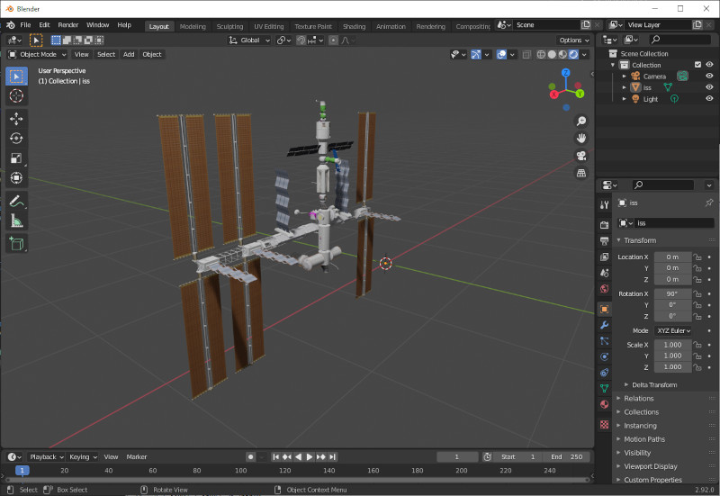

# CMODConvert

A utility to convert from Celestia's .cmod files (binary and ASCII formats are supported) to
Wavefront .obj/.mtl files. This may be useful for importing them into 3D editor software that does
not have built-in support for the Celestia format.



Note that the features supported by the two file formats differ: if the .cmod file uses these
features, a warning message will be output and the feature will either be dropped or only
partially represented. Such features include, but are not limited to:

* Point sprite sizes: sprites are output as points instead.
* Separate UV-mapping for diffuse/emissive/specular textures: only one set of texture coordinates
  is used.
* Normal maps.

Note that Celestia-specific features, such as the directory handling (in particular, when importing
into Blender, texture files must be located in the same directory as the .obj and .mtl files), and
asset filename wildcard extensions are not altered. This may require manual alterations to the .mtl
file. Spaces in asset names will cause problems.

The application runs on the command line, taking the input cmod file as a first parameter. By
default, the .obj and .mtl files will be output to the same directory, this can be changed
using the `--output-file` and `--output-mtl` options. For details, run with the `--help` option.

Building the application requires .NET 5.0. The supplied cross-platform binary requires the .NET
5.0 runtime to be installed.

Example usage:

```Shell
dotnet CmodConvert.dll some/directory/iss.cmod
```